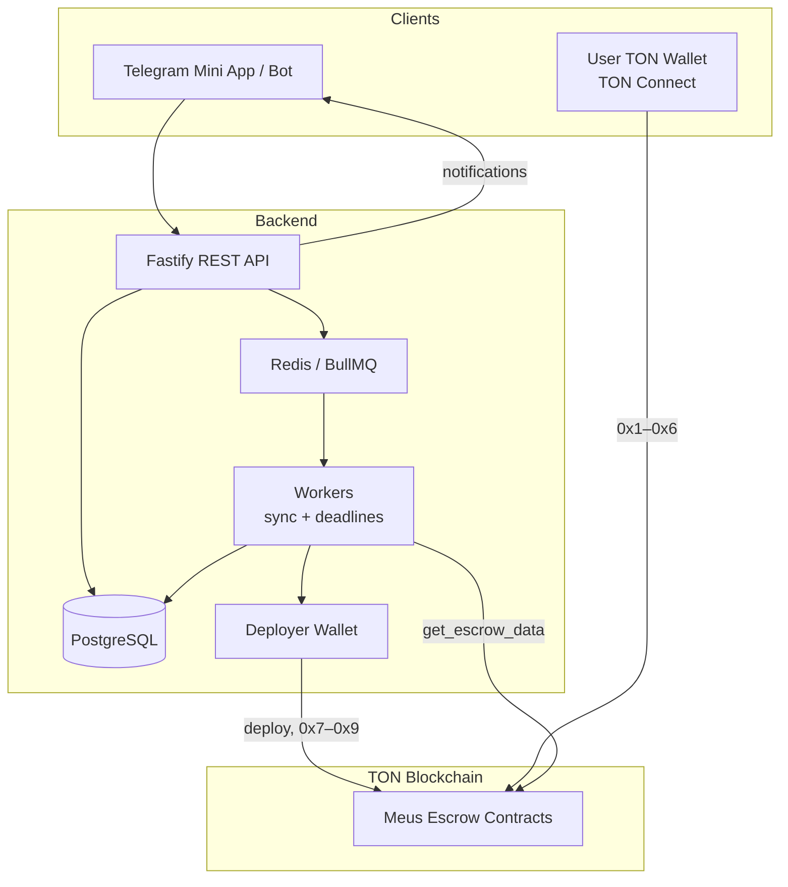

# Meus

Meus is a TON blockchain escrow platform built for Telegram. Employers and freelancers lock funds in per-deal smart contracts; the backend deploys contracts, syncs on-chain state, runs deadline jobs, and exposes a REST API for a Telegram Mini App. Users sign on-chain actions (deposit, submit, approve, etc.) with their own wallets via TON Connect.

This repository is a monorepo with two main parts: the FunC smart contract and the Node.js API.

---

## Monorepo structure

| Folder | Purpose |
|--------|---------|
| [`Smart-contract/`](Smart-contract/) | FunC escrow contract (`contracts/meus.fc`), TypeScript wrappers (`wrappers/Meus.ts`), Blueprint build/test scripts, and Jest tests. See [`Smart-contract/README.md`](Smart-contract/README.md) for Blueprint usage. |
| [`backend/`](backend/) | Fastify 5 API, Prisma/PostgreSQL, Redis, BullMQ workers, TON deployer integration. See [`backend/SETUP.md`](backend/SETUP.md) for deployer wallet, BOC path, migrations, and production Docker. |
| [`backend/contract/`](backend/contract/) | Compiled contract code BOC consumed by the API. See [`backend/contract/README.md`](backend/contract/README.md). |
| [`scripts/`](scripts/) | Repo-level helpers (e.g. `export-boc.sh`). |

---

## Prerequisites

- **Node.js** 20 LTS or newer (22 recommended for Smart-contract tooling)
- **Docker** and Docker Compose (PostgreSQL + Redis locally)
- **TON Blueprint** — installed via `npm install` inside `Smart-contract/` (`@ton/blueprint`)
- **TON CLI** (optional) — useful for manual chain inspection; not required for the default dev flow

---

## Quick start

```bash
# 1. Clone
git clone <your-repo-url> Meus
cd Meus

# 2. Build the smart contract and export code BOC
cd Smart-contract
npm install
npm run build
cd ..
npm run export-boc          # writes backend/contract/meus.code.boc

# 3. Backend setup
cd backend
npm install
cp .env.example .env        # fill in secrets (see table below)
docker compose up -d
npx prisma migrate deploy
npm run dev
```

API base URL: `http://localhost:3000`  
Health check: `GET http://localhost:3000/health`

---

## Environment variables

Defined in [`backend/src/config/index.ts`](backend/src/config/index.ts). Copy [`backend/.env.example`](backend/.env.example) to `backend/.env`.

| Variable | Required | Description |
|----------|----------|-------------|
| `NODE_ENV` | No | `development`, `production`, or `test` (default: `development`) |
| `PORT` | No | HTTP port (default: `3000`) |
| `HOST` | No | Bind address (default: `0.0.0.0`) |
| `DATABASE_URL` | **Yes** | PostgreSQL connection string for Prisma |
| `REDIS_URL` | No | Redis URL for BullMQ and rate limiting (default: `redis://localhost:6379`) |
| `JWT_SECRET` | **Yes** | Secret for signing API JWTs (min 32 characters) |
| `JWT_EXPIRES_IN` | No | JWT lifetime, e.g. `7d` (default: `7d`) |
| `TELEGRAM_BOT_TOKEN` | **Yes** | Telegram bot token for Mini App auth and notifications |
| `TON_NETWORK` | No | `testnet` or `mainnet` (default: `testnet`) |
| `TON_ENDPOINT` | No | TON HTTP API endpoint (default: testnet Toncenter) |
| `TON_API_KEY` | No | Toncenter API key (optional but recommended) |
| `DEPLOYER_MNEMONIC` | **Yes** | 24-word mnemonic for the platform deployer wallet (deploy + ops 0x7–0x9) |
| `ARBITER_ADDRESS` | **Yes** | Default arbiter TON address burned into each escrow |
| `CONTRACT_CODE_PATH` | **Yes** | Path to `meus.code.boc` (default in example: `./contract/meus.code.boc`) |
| `LOG_LEVEL` | No | Pino log level (default: `info`) |

---

## Smart contract opcodes

From [`Smart-contract/wrappers/Meus.ts`](Smart-contract/wrappers/Meus.ts) / [`backend/src/modules/blockchain/contract.wrapper.ts`](backend/src/modules/blockchain/contract.wrapper.ts):

| Op | Name | Who calls (on-chain) |
|----|------|----------------------|
| `0x1` | `deposit` | Employer (user wallet) |
| `0x2` | `submit` | Freelancer (user wallet) |
| `0x3` | `approve` | Employer (user wallet) |
| `0x4` | `dispute` | Employer (user wallet) |
| `0x5` | `resolve` | Arbiter (user wallet) |
| `0x6` | `cancel` | Employer (user wallet) |
| `0x7` | `auto_release` | Backend deployer (after review deadline) |
| `0x8` | `resolve_timeout` | Backend deployer (dispute + 30 days) |
| `0x9` | `refund_expired` | Backend deployer (funded + past deadline) |

Ops `0x1`–`0x6` are initiated from user wallets via TON Connect. The backend records DB state and syncs from chain. Ops `0x7`–`0x9` are sent automatically by the deployer wallet when deadlines pass (see [`backend/SETUP.md`](backend/SETUP.md)).

---

## API overview (`/api/v1`)

| Group | Routes | Description |
|-------|--------|-------------|
| **Health** | `GET /health` | Liveness: Postgres + Redis checks |
| **Auth** | `POST /auth/telegram` | Authenticate via Telegram Mini App `initData`; returns JWT |
| | `POST /auth/connect-wallet` | Link wallet to account (legacy, JWT required) |
| | `POST /auth/ton-proof/generate-payload` | Issue TON Connect proof nonce |
| | `POST /auth/ton-proof/check-proof` | Verify TON Connect proof and link wallet |
| **Users** | `GET /users/me` | Current user profile |
| | `GET /users/search` | Search users by username or Telegram ID |
| | `GET /users/:id` | User by ID |
| **Escrows** | `POST /escrows`, `POST /escrow` | Create and deploy escrow contract |
| | `GET /escrows` | List escrows for the authenticated user |
| | `GET /escrows/:id` | Escrow detail (parties only) |
| | `POST /escrows/:id/deploy` | Record frontend-deployed contract (legacy) |
| | `POST /escrows/:id/submit` | Record work submission (DB; chain via freelancer) |
| | `POST /escrows/:id/approve` | Record employer approval (DB; chain via employer) |
| | `POST /escrows/:id/cancel` | Record cancellation (DB; chain via employer) |
| **Disputes** | `POST /disputes` | Open a dispute on submitted work |
| | `GET /disputes` | List disputes for user's escrows |
| | `GET /disputes/:id` | Dispute detail |
| | `POST /disputes/:id/resolve` | Arbiter records resolution (DB; chain via arbiter) |
| **Notifications** | `GET /notifications` | List notifications for current user |
| | `POST /notifications/:id/read` | Mark one notification read |
| | `POST /notifications/read-all` | Mark all read |

Most escrow/dispute routes require `Authorization: Bearer <jwt>`.

---

## Architecture



**Layers:** (1) TON blockchain — one escrow contract per deal; (2) backend — API, DB, jobs, deployer; (3) Telegram — auth and push notifications; (4) user wallet — funds and permissioned ops.

---

## Known limitations

- **Single arbiter** — one `ARBITER_ADDRESS` is used for every escrow; no arbiter marketplace or rotation.
- **Hardcoded commission wallet** — Tiered commission is sent to a fixed address compiled into the contract (`COMMISSION_WALLET` in the wrapper); not configurable per escrow.

| Escrow amount | Commission |
|---------------|------------|
| Up to 100 TON | 3% |
| 100–500 TON | 2% |
| Over 500 TON | 1% |
- **No upgrade mechanism** — deployed contracts cannot be upgraded; logic changes require new deployments.
- **Off-chain dispute data** — dispute reasons and evidence live in PostgreSQL only; the chain stores dispute status, not documents.
- **Backend availability** — automated `auto_release`, `resolve_timeout`, and `refund_expired` depend on the deployer wallet and background workers running; users can still call some paths on-chain directly, but the product assumes the backend is online.

---

